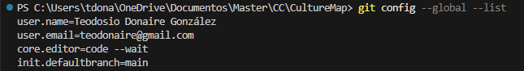
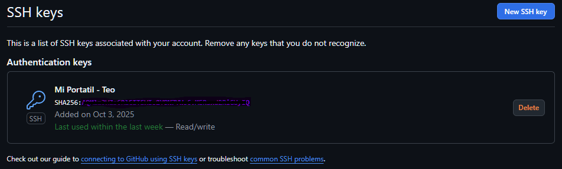
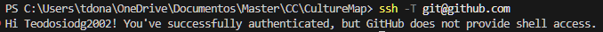
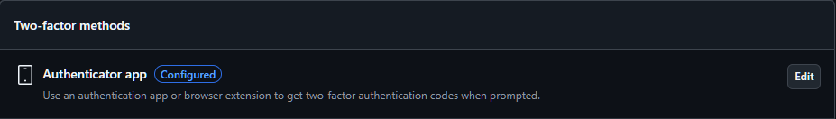

# ⚙️ Configuración del Entorno de Desarrollo

Este documento detalla la configuración del entorno de desarrollo para el proyecto CultureMap, incluyendo evidencias visuales de cada paso.

---

## 🔧 Git - Configuración Local

### **Configuración de Usuario**

Se ha configurado Git localmente con la información del desarrollador:

```bash
git config --global user.name "Teodosio Donaire González"
git config --global user.email "teodonaire@gmail.com"
```
**Verificación de la configuracion**

```bash
git config --global --list
```


---

## 🔑 Claves SSH

Generación del par de claves SSH ED25519:

```bash
ssh-keygen -t ed25519 -C "teodonaire@gmail.com"
```
Clave pública añadida a GitHub:
Ruta: GitHub → Settings → SSH and GPG keys → New SSH key



**Verificación de conexión SSH**

```bash
ssh -T git@github.com
```


---

## 👤 Perfil de GitHub

Perfil completado con toda la información indicada


---

## 🔐 Autenticación de Dos Factores (2FA)

Se ha activado 2FA en GitHub:

Método: Aplicación de autenticación: Google Authenticator

Códigos de recuperación guardados de forma segura



---

## 🛠️ Herramientas de Desarrollo

Software instalado:

| Herramienta | Versión | Propósito             |
| ----------- | ------- | --------------------- |
| Git         | 2.49.0  | Control de versiones  |
| Python      | 3.13.7  | Backend / scripts     |
| VS Code     | Latest  | Editor de código      |
| Postman     | Latest  | Testing de APIs       |

---

_Documento completado el [4/10/2025]_
