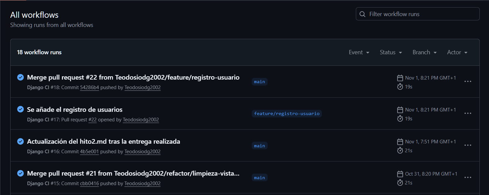
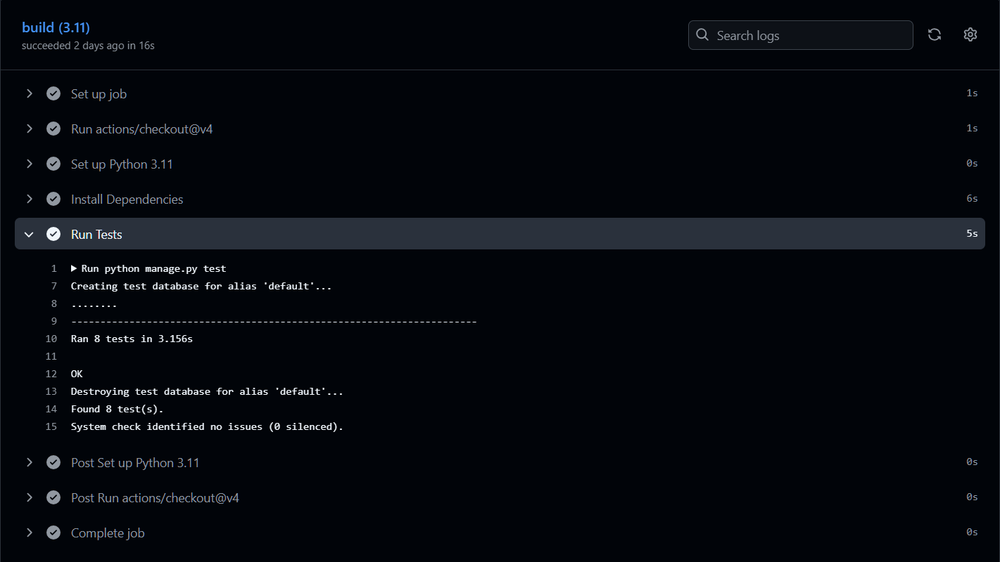

# 📋 Hito 2: Integración Continua (CI)

## 🎯 Objetivos del Hito

El objetivo principal de este hito es implementar **Integración Continua (CI)** en el proyecto. Para ello primero deberemos de tener una serie de funciones básicas en la aplicación para poder probar los test. Por ello, este será el planning para desarrollar el hito2:

1.  **Desarrollar una base para el backend** sobre la cual poder ejecutar los tests.
2.  **Rellenar la base de datos** con datos de prueba.
3.  **Elegir y configurar un gestor de tareas** y un marco de pruebas.
4.  **Escribir tests** para la lógica de negocio principal.
5.  **Configurar un servicio de CI (GitHub Actions)** para que ejecute los tests automáticamente.

---

## 🏗️ Desarrollo del Backend (CRUD Básico)

Antes de comenzar con la ejecución de los test, he desarrollado las funcionalidades de **leer y listar** para el modelo `Lugar`. Esto nos permite tener una base para poder escribir y probar los test. 

### **Vistas y Lógica de Negocio (`views.py`)**

Se han implementado las siguientes vistas principales:

-   **`listar_lugares_todos`**: Muestra una lista de todos los lugares.
-   **`listar_lugares_aprobados`**: Muestra una lista de todos los lugares que han sido aprobados por un administrador y están marcados como publicados.
-   **`detalle_lugar`**: Muestra la página de detalle de un lugar específico. Utiliza `get_object_or_404` para devolver un error 404 si se intenta acceder a un lugar que no existe o no está aprobado.

Se han creado dos vistas para listar los lugares. Un de ellas muestra todos los lugares y la otra, solo muestra aquellos que estan aprobados. Probablemente esto varíe a lo largo del desarrollo de la aplicación, pero de momento lo he implementado para comprobar que se esten ejecutando distintos métodos correctamente.

### **Sistema de Rutas (`urls.py`)**

-   `/lugares/`: Muestra todos los lugares.
-   `/lugares/aprobados/`: Dirige a la lista de lugares públicos.
-   `/lugares/<int:pk>/`: URL dinámica que captura el ID de un lugar y lo pasa a la vista de detalle.

### **Plantillas HTML (`templates`)**

Se han creado las plantillas HTML necesarias para renderizar la información. Estas plantillas no son las definitivas pero sirven para comprobar el correcto funcionamiento de los métodos:

-   `listar_lugares_aprobados.html` y `listar_lugares_aprobados.html`: Usa un bucle `` para iterar sobre la lista de lugares y la etiqueta `` para generar enlaces dinámicos a la página de detalle.
-   `detalle_lugar.html`: Muestra los atributos del objeto `lugar` que le pasa la vista.

---

##  Añadir Datos

Para facilitar el desarrollo y las pruebas, se ha creado una **migración de datos** (`0002_anadir_datos_iniciales.py`) que rellena la base de datos con un conjunto de lugares de ejemplo en Granada.

**Ventajas de este enfoque:**
-   **Rapidez**: Permite insertar múltiples registros con un solo comando (`python manage.py migrate`).
-   **Consistencia**: Asegura que todos los miembros del equipo (o los sistemas de CI) trabajen con los mismos datos iniciales.
-   **Versionado**: Los datos de prueba están versionados en Git junto con el resto del código.

---

## 🔧 Elección de Herramientas de Testing

### **1. Gestor de Tareas**

* **Decisión**: `manage.py` de Django.
* **Justificación**: Para un proyecto Django, `manage.py` es la herramienta estándar para ejecutar tareas del proyecto, incluyendo los tests (`python manage.py test`). Integrar un gestor de tareas externo como `make` sería añadir un nivel de complejidad extra y que resulta innecesario. La gestión de dependencias se realiza con `pip` y `requirements.txt`, que es el estándar en el ecosistema de Python.

### **2. Marco de Pruebas y Biblioteca de Aserciones**

* **Decisión**: Framework de testing integrado de Django (basado en `unittest` de Python).
* **Justificación**: Se ha elegido el framework nativo de Django por su **integración total** con el proyecto. Permite:
    * **Creación de una BD de pruebas** automática en cada ejecución, aislando los tests de los datos de desarrollo.
    * **Un cliente de pruebas (`self.client`)** para simular peticiones HTTP (GET, POST) y probar las vistas de forma realista sin un navegador.
    * **Aserciones específicas de Django** como self.assertContains(), self.assertNotContains() y self.assertRedirects().

### **3. Tests Implementados**

Se ha implementado un conjunto de 8 tests en lugares/tests.py que validan lo siguiente:

#### **Test de Modelo (LugarModelTests):**

* **test_propiedad_es_visible:** Valida que la propiedad es_visible del modelo Lugar funciona correctamente.

#### **Tests de Vista (LugarViewTests):**

* **test_vista_index_lugares_funciona:** (Test actualizado) Comprueba que la lista pública (index_lugares) carga (código 200) y filtra correctamente (muestra aprobados, oculta pendientes).

* **test_vista_detalle_funciona_para_lugar_aprobado:** Comprueba que el detalle de un lugar aprobado es accesible (código 200).

* **test_vista_detalle_da_404_para_lugar_pendiente:** Valida la lógica de seguridad, asegurando que intentar acceder al detalle de un lugar no aprobado devuelve un error 404.

* **test_login_post_redirects_to_index:** (Nuevo) Prueba que un POST exitoso al formulario de login redirige a la página principal (index_lugares), validando la configuración LOGIN_REDIRECT_URL.

* **test_protected_view_redirects_to_login:** (Nuevo) Prueba que la vista crear_lugar (protegida con @login_required) redirige correctamente a un usuario anónimo a la página de login.

* **test_crear_lugar_get_authenticated_user:** (Nuevo) Prueba que un usuario logueado puede acceder (código 200) al formulario para crear un lugar.

* **test_crear_lugar_post_authenticated_user:** (Nuevo) Prueba que un usuario logueado puede enviar (POST) un nuevo lugar, que este se crea con el estado correcto ('pendiente') y el creado_por correcto, y que redirige al index_lugares.
---

## ⚙️ Integración Continua (CI)

* **Sistema Elegido**: GitHub Actions.
* **Justificación**: Se ha seleccionado por ser la solución nativa de GitHub, lo que elimina la necesidad de configurar servicios de terceros. Es gratuita para repositorios públicos y se configura mediante un simple archivo YAML (`.github/workflows/django-ci.yml`) dentro del propio repositorio.
* **Estado**: **Completado**. Se ha configurado el workflow `django-ci.yml`. Tras corregir la versión de Python a 3.11, el workflow se ejecuta correctamente. Ahora, cada `push` o `pull_request` a la rama `main` disparará automáticamente la ejecución de la suite de tests (`python manage.py test`), asegurando que no se integre código roto en la rama principal.

---

## Comprobación de los test

A continuación muestro la lista de los test que se han ido ejecutando con cada modificacion. En todas ellas, se observa que el test se ha hecho de manera exitosa:

Aquí, muestro en mas detalle la informacion del test:

_Documento actualizado el [03/11/2025]_
