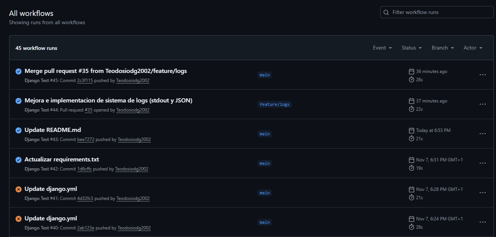
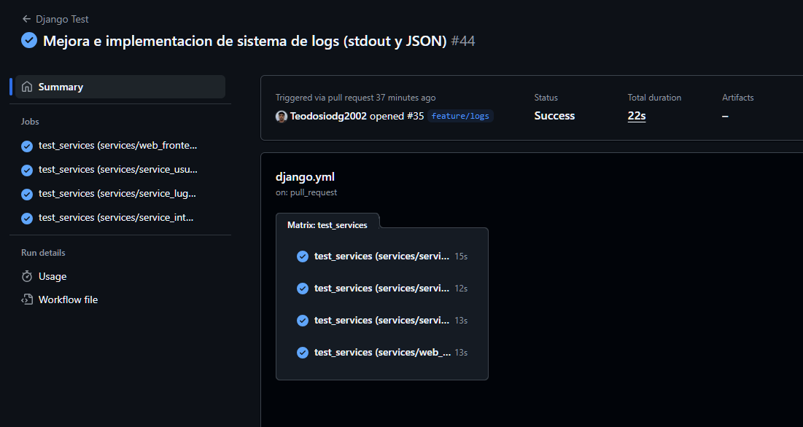

# 📋 Hito 3: Diseño de Microservicios

## 🎯 Objetivos del Hito

El objetivo de este hito es pasar de una arquitectura monolítica (Hito 2) a una arquitectura separada basada en **microservicios**. Esto implica diseñar y construir la base de la aplicación con servicios independientes, cada uno con una responsabilidad única y con una base de datos única, para preparar la aplicacion para el despliegue en contenedores (Hito 4).

---

## 🔧 1. Justificación del Framework de API

Para desarrollar la capa de API REST en cada microservicio, se ha hecho una breve comparación entre los principales frameworks disponibles en Python, con el objetivo de elegir el que mejor se adapte al proyecto y al nivel de experiencia.

### Estado del Arte de Frameworks de API en Python

1.  **Django REST Framework (DRF):**
    * **Pros:** Se integra perfectamente con Django, lo que permite aprovechar el ORM, el sistema de autenticación y los permisos. Además, tiene una comunidad muy grande y una documentación excelente.
    * **Contras:** Es algo más “pesado” para un microservicio pequeño, ya que incluye todo el ecosistema de Django aunque no se necesite por completo.

2.  **FastAPI:**
    * **Pros:** Es un framework moderno, rápido y muy eficiente. Utiliza validación de datos automática con Pydantic y genera documentación interactiva de forma nativa (Swagger/OpenAPI).
    * **Contras:** Requiere aprender una nueva forma de trabajar (con dependencias y Pydantic) y no se pueden usar directamente los modelos de Django, lo que complicaría la integración.

3.  **Flask:**
    * **Pros:** Es ligero, sencillo y muy flexible.
    * **Contras:** Resulta demasiado básico para este tipo de proyecto, ya que habría que añadir a mano muchas cosas (ORM, sistema de usuarios, serialización, etc.), lo que aumentaría la complejidad.

### Decisión Técnica: Django REST Framework (DRF)

Finalmente se ha optado por **Django REST Framework** para todos los microservicios.
Aunque FastAPI podría ofrecer mejor rendimiento en entornos muy grandes, en este caso se ha priorizado la coherencia tecnológica y la rapidez de desarrollo.
Al usar Django en todos los servicios, se aprovecha el conocimiento ya adquirido y se facilita el mantenimiento. Además, el ORM y la estructura de proyectos de Django permiten avanzar más rápido y mantener un estilo uniforme entre los diferentes microservicios.

---

## 🚀 2. Diseño de la Arquitectura y API

Para este hito, se ha optado por una arquitectura basada en microservicios, organizada bajo un esquema **“Monorepo”**, es decir, un único repositorio que contiene el código de todos los servicios.
Además, se ha adoptado el principio **“Database per Service”**, de forma que cada microservicio gestiona su propia base de datos y mantiene así un mayor aislamiento y autonomía.

### Arquitectura de Servicios

Dentro del repositorio se ha creado una carpeta llamada `services/`, que agrupa los distintos proyectos Django, cada uno con una responsabilidad clara dentro del sistema. De esta forma, el monolito inicial evoluciona progresivamente hacia una arquitectura modular y escalable.

A continuación se describen los servicios principales y su papel dentro del ecosistema de la aplicación CultureMap: 

1.  **`service_web_frontend` (Proyecto Django 1 - El Monolito)**
    * **Responsabilidad:** Servir la interfaz web (HTML, CSS y JS) con la que el usuario interactúa: el mapa, los formularios o la visualización de lugares.
    * **Base de Datos:** Propia (`db.sqlite3`).

2.  **`service_usuarios` (Proyecto Django 2 - Nuevo)**
    * **Responsabilidad:** Gestión de usuarios y autenticación.
    * **Base de Datos:** Propia (solo con tablas `User`, etc.).

3.  **`service_lugares` (Proyecto Django 3 - Nuevo)**
    * **Responsabilidad:** Administración del catálogo de lugares dentro de la aplicación.
    * **Base de Datos:** Propia (solo con la tabla `Lugar`).
    * **Endpoints Principales:**
        * `GET /api/lugares/`: Devuelve la lista de lugares aprobados
        * `POST /api/lugares/`: (Requiere autenticación) Permite proponer un nuevo lugar con estado “pendiente”.
        * `GET /api/lugares/<id>/`: Muestra el detalle de un lugar concreto.

4.  **`service_interacciones` (Proyecto Django 4 - Nuevo)**
    * **Responsabilidad:** Gestionar la parte social de la plataforma: votos, comentarios y favoritos.
    * **Base de Datos:** Propia (con `Voto`, `Comentario`, `Favorito`).
    * **Endpoints Principales:**
        * `POST /api/interacciones/votar/`: (Autenticado) Registrar un voto sobre un lugar.
        * `GET /api/interacciones/lugar/<id_lugar>/comentarios/`: Listar los comentarios asociados a un lugar.
        * `POST /api/interacciones/lugar/<id_lugar>/comentarios/`: (Autenticado) Añadir un nuevo comentario.

5.  **`service_eventos` (Diseño)**
    * **Responsabilidad:** Planificación de eventos geolocalizados, como conciertos, charlas o exposiciones.
    * **Estado:** *Diseñado, pendiente de implementación.*

6.  **`service_api_gateway` (Diseño)**
    * **Responsabilidad:** Servirá como punto de entrada único al sistema, actuando como puerta de enlace (gateway) que centraliza las peticiones hacia los demás microservicios.
    * **Estado:** *Diseado, pendiente de implementación.*

*(...Esta sección se rellenará con el código a medida que se implemente...)*

---

## 📝 3. Sistema de Logs

Como parte del diseño de los microservicios, se ha tenido en cuenta la necesidad de contar con un **sistema de logs centralizado**, que permita registrar la actividad de cada servicio y facilitar su monitorización.
Para ello, se ha realizado una pequeña revisión de las principales herramientas disponibles actualmente.

### Estado del Arte de Agregación de Logs

1.  **Stack ELK (Elasticsearch, Logstash, Kibana):**
    * **Pros:** Es la opción más conocida en entornos profesionales. Permite realizar búsquedas y análisis avanzados, así como visualizar métricas y eventos en tiempo real.
    * **Contras:** Su configuración es bastante compleja y consume bastantes recursos, sobre todo por el uso de Elasticsearch.

2.  **Fluentd / Fluent Bit:**
    * **Pros:** Alternativa más ligera y eficiente que Logstash, con gran compatibilidad gracias a su sistema de plugins.
    * **Contras:** Aunque es más simple, también necesita un sistema de almacenamiento y visualización adicional (como Elasticsearch o Grafana), por lo que no elimina del todo la complejidad.

3.  **Servicios SaaS (Datadog, Loggly):**
    * **Pros:** Ofrecen una solución completa sin necesidad de mantener servidores o infraestructura.
    * **Contras:** Tienen un coste económico, lo que los hace menos adecuados para este proyecto.

### Decisión Técnica: Log a `stdout` y a Archivo JSON

Para esta parte del hito he elegido implementar una solución híbrida, haciendo que los logs se muestren por la salida estandar para después en el hito 4, recoger esa información y poder realizar una monitorización. Además, estos logs se quedan recogidos en un archivo dentro del microservicio

* **Implementación:** 
1.  Se ha instalado la librería `python-json-logger` en cada uno de los 4 servicios.
2.  Se ha configurado el módulo `logging` en el `settings.py` de cada microservicio, para que como he comentado antes realice dos funciones.
    1.  Envía un log simple a la **salida estándar (`stdout`)**.
    2.  Envía un log completo en formato **JSON** a un archivo separado para cada servicio (ej. `services/service_lugares/logs/api.log`).

* **Justificación:** 

Esta solución crea un sistema de logs que permite comprobar el archivo de log dedicado para cada servicio, facilitando la depuración y el registro de la actividad de la API de forma aislada.
Además, se prepara el proyecto para el hito 4 formateando la salida por pantalla de los logs. Esto facilita al colector de logs (Promtail) recoger todos los logs de las aplicaciones y mandarlo a Loki, que estará integrado con grafana en el proyecto
En el siguiente hito, com ya acabo de mencionar, preveo integrar Grafana junto a Loki y Promtail como sistema de visualización y gestión de logs, aprovechando que los microservicios ya envían su salida de logging a stdout.

---

## 🧪 4. Ejecución de Tests

Para corregir los test y abarcar todos los requisitos de este punto se ha modificado la manera de ralizar los test. En lugar de haber solo uno para toda la aplicacion, cada microservicio, tendrá el suyo propio y será responsable de comprobar su correcto funcionamiento.

Se han implementado 16 test en total:

- **service_usuarios:**
  - Se comprueba el endpoint de registro (POST /api/register/), incluyendo casos de éxito (201 Created), contraseñas que no coinciden (400 Bad Request) y usuarios duplicados (400 Bad Request).
  - Se comprueba el endpoint de login (POST /api/token/), validando un login exitoso (200 OK y recepción de tokens) y un login fallido (401 Unauthorized).

- **service_lugares:**
  - Se comprueba el funcionamiento de la funcion de leer lugares de la base de datos(GET /api/catalogo/lugares/), asegurando que los usuarios anónimos solo vean los lugares aprobados y no los pendientes.
  - Se comprueban los permisos: un usuario anónimo recibe un 401/403 al intentar crear un lugar (POST), mientras que un usuario autenticado puede hacerlo (201 Created).
  - Se valida la lógica de perform_create, asegurando que un nuevo lugar se guarda automáticamente con estado="pendiente" y con el creado_por_id correcto del usuario autenticado.

- **service_interacciones:**
  - Se comprueba que un usuario crea un voto (201 Created) y que, si vuelve a votar, el sistema ejecuta update_or_create y actualiza el voto (200 OK).
  - Se comprueban los permisos de Comentario, permitiendo la lectura anónima (GET) pero exigiendo autenticación para crear (POST).
  - Se valida perform_create de comentarios, asegurando que usuario_id y lugar_id se asignan automáticamente desde el token y la URL.

**Integracion continua:**

Se modifica el archivo django-ci.yml para que sea compatible con la nueva arquitectura. Para ello se ha usado un "matriz de estrategia" (strategy: matrix) para ejecutar 4 trabajos en paralelo. Cada uno es responsable de:

1. Hacer cd a la carpeta de su servicio (ej. cd services/service_lugares).
2. Instalar las dependencias de su requirements.txt específico.
3. Ejecutar su propia suite de tests (python manage.py test).

