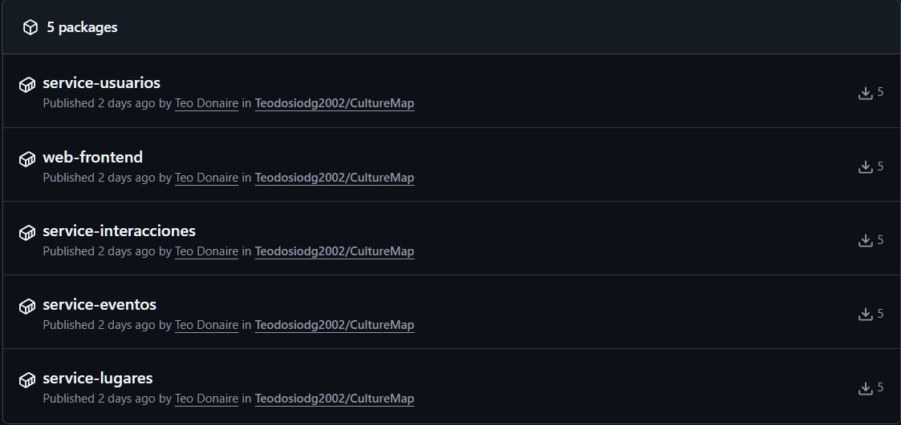
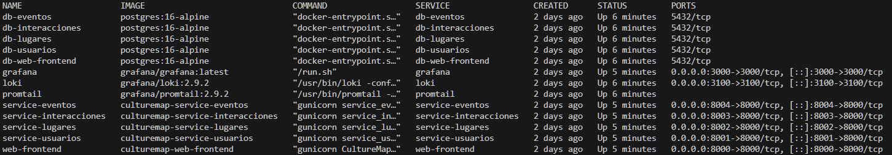
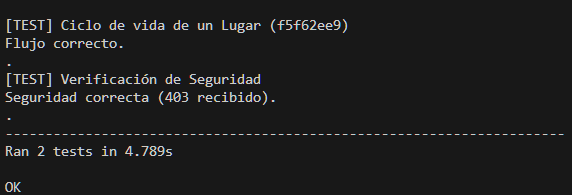
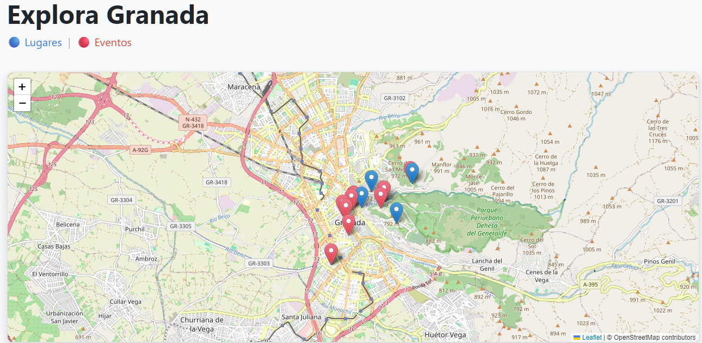
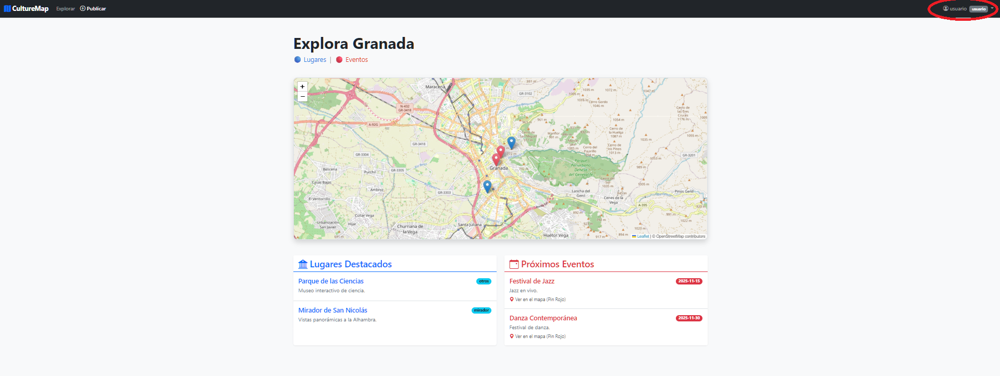
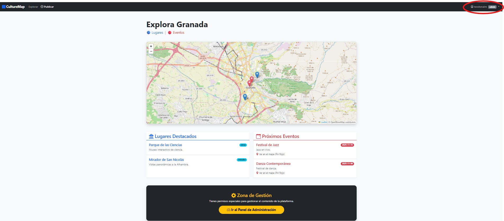
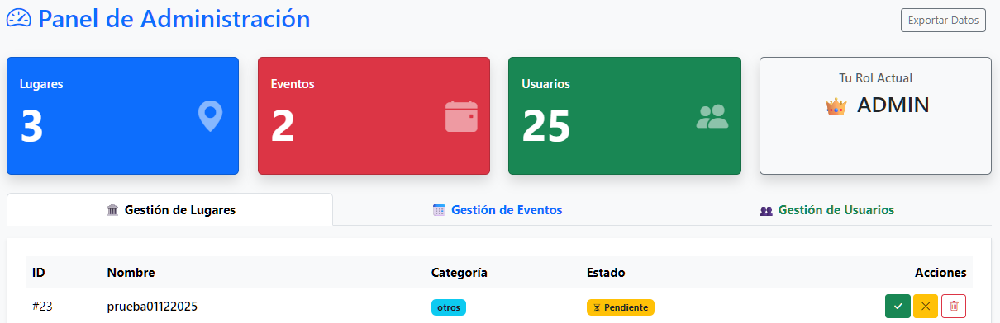
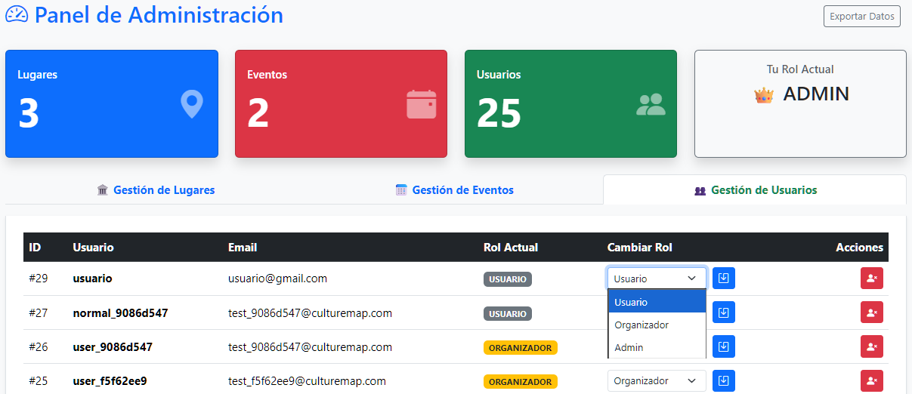
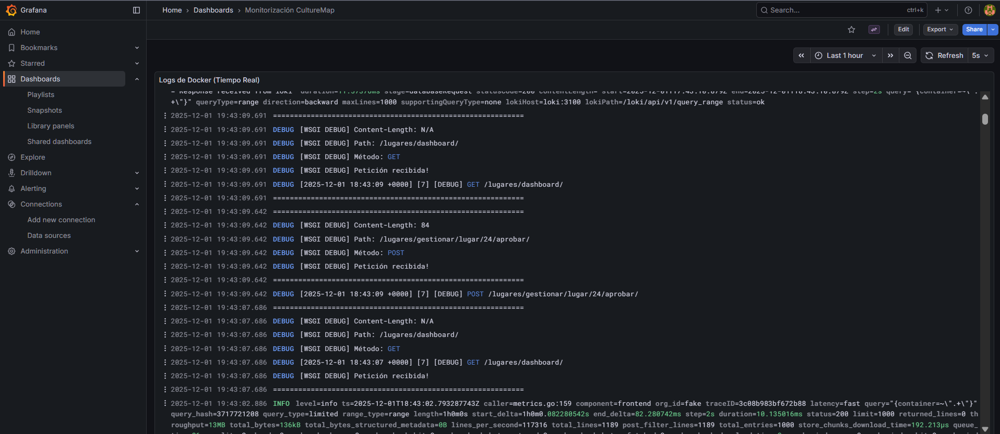

# 📋 Hito 4: Composición de Servicios (Docker)

## 🎯 Objetivos del Hito

El objetivo principal de este hito ha sido pasar desde una arquitectura monolítica a una arquitectura de microservicios distribuida y dockerizada. Para ello, se ha implementado y desplegado un clúster de contenedores orquestados por ***Docker Compose***.
Al finalizar este hito, la aplicación consta con 5 microservicios funcionales, 5 bases de datos PostgreSQL aisladas y un stack completo de monitorización (Grafana, Loki y Prometheus)

---

## 1. Estructura del Clúster de Contenedores

### 1.1. Diseño de la Arquitectura

La arquitectura de la aplicacion se compone de un clúster con los siguientes elementos interconectados a través de una red interna ('culturemap_network'):

1. **`web-frontend` (Gateway/BFF)**: Expuesto en el puerto `8000`. Actúa como cliente de las APIs internas. No tiene acceso directo a las bases de datos de los otros servicios. Se comunica exclusivamente vía HTTP (REST).
2. **`service-usuarios`**: Microservicio de identidad. Gestiona el registro, login y emisión de tokens JWT.
3. **`service-lugares`**: Microservicio de catálogo. Gestiona la información de los lugares.
4. **`service-eventos`**: Microservicio de eventos. Gestiona la información de los eventos.
5. **`service-interacciones`**: Microservicio social (valoraciones y comentarios).

### 1.2. Gestión de Datos (Volúmenes Persistentes)

Debido al requisito en la práctica de tener un contenedor exclusivo cuya funcion sea almacenar datos, se ha implementado el patron de diseño ***"Database-per-Service"***.

En las fases anteriores, el desarrollo de la aplicación se centraba en SQLite. Sin embargo, para un entorno en contenedores, esta solución presenta problemas de concurrecia (múltiples peticiones a la vez) y carece de escalabilidad.

* **Decisión Técnica**: Migración de SQLite a **PostgreSQL 16**. SQLite no soporta bien la concurrencia (múltiples accesos a la base de datos) en un entorno de contenedores.
* **Implementación:** Se han desplegado **5 instancias independientes de PostgreSQL**, una para cada servicio.
* **Persistencia:** Se han definido volúmenes de Docker con nombre (`postgres_lugares_data`, `postgres_usuarios_data`, etc.) para garantizar que los datos sobrevivan al ciclo de vida de los contenedores.

---

## 2. Configuración de los Contenedores

### 2.1. Justificación de la Imagen Base

Se ha realizado un análisis comparativo para seleccionar la imagen base de los microservicios Python/Django:

1. **`django:onbuild` (Oficial)**: Es la imagen oficial del proyecto Django, y viene con una versión de Python y Django ya preinstalada y configurada. Sin embargo, Como podemos ver en la siguiente imagen, está obsoleta y ella misma te indica usar contenedores python.


2. **`python:3.12-alpine`**: Evaluada por su ligereza. Descartada debido a que utiliza *Alpine Linux*, conocido por causar fallos de compilación con algunas funcionalidades de Python, especialmente `psycopg2` (PostgreSQL). Existe cierto riesgo con que no sea compatible con mi aplicación.

3. **`python:3.12-slim-bookworm` (ELEGIDA)**:
    * **Justificación:** Hemos seleccionado esta imagen porque representa el punto medio ideal entre eficiencia y facilidad de uso:
      * *Peso reducido (Versión slim):* Contiene solo lo esencial para que Python funcione. Se han eliminado herramientas y archivos de "relleno" que no vamos a utilizar, lo que hace que la imagen ocupe mucho menos espacio y se descargue más rápido.
      * *Máxima compatibilidad (Base Debian):* Al estar construida sobre Debian ("Bookworm"), funciona como un sistema Linux estándar. Esto garantiza que el sistema operativo se comporte de manera predecible y estable, igual que un servidor tradicional.
      * *Facilidad de instalación:* A diferencia de otras versiones ultraligeras (como Alpine) que obligan a "fabricar" (compilar) las librerías complejas manualmente, esta versión nos permite instalar paquetes de Python ya preparados (wheels). Esto nos ahorra mucho tiempo de configuración y evita errores complejos durante la instalación de herramientas como bases de datos.

---

## 3. Documentación de los Dockerfiles

Cada microservicio cuenta con su propio `Dockerfile`. A continuación se explica en detalle estructura estándar utilizada:

```dockerfile
# 1. Imagen Base: Python 3.12 Slim (Debian Bookworm)
FROM python:3.12-slim-bookworm

# 2. Variables de entorno para optimizar Python en Docker
ENV PYTHONDONTWRITEBYTECODE 1
ENV PYTHONUNBUFFERED 1

# 3. Instalación de dependencias del sistema (necesarias para Postgres client)
RUN apt-get update \
    && apt-get install -y --no-install-recommends postgresql-client \
    && rm -rf /var/lib/apt/lists/*

# 4. Directorio de trabajo
WORKDIR /app

# 5. Gestión de dependencias Python
COPY requirements.txt .
RUN python -m pip install --upgrade pip
RUN python -m pip install gunicorn psycopg2-binary
RUN python -m pip install -r requirements.txt

# 6. Copia del código fuente
COPY . .

# 7. Exposición y Arranque con Gunicorn (Servidor de Producción)
EXPOSE 8000
CMD ["gunicorn", "--bind", "0.0.0.0:8000", "[nombre_servicio].wsgi:application"]
```

---

## 4. Publicación en GitHub Packages 

Para automatizar la construcción y publicación de las imágenes, se ha configurado un flujo de trabajo en GitHub Actions.

### 4.1 Funcionamiento del Workflow

El archivo `.github/workflows/docker.yml` implementa el proceso:

1. **Activación:** Cada vez que se realiza un push en la rama main.

2. **Construcción:** Se generan todas las imágenes necesarias utilizando una matriz de servicios.

3. **Publicación:** Las imágenes se suben automáticamente al GitHub Container Registry (GHCR) con la etiqueta latest.

Con esto, me aseguro que todas las imagenes de los contenedores esten siempre actualizadas y disponibles.



---

## 5. Composición del Clúster: compose.yaml

El archivo `compose.yaml` orquesta la totalidad de la infraestructura. En él se especifican:

* **Servicios:** configuración de puertos, rutas a archivos .env, dependencias y volúmenes.

* **Redes:** definición de una red interna tipo bridge para la comunicación interna entre contenedores.

* **Dependencias:** mediante depends_on, asegurando que los servicios dependientes se inicien en el orden adecuado.



---

## 6. Test de Integración del Clúster

Se ha implementado un test de integración en integration_tests/test_cluster.py que comprueba el funcionamiento conjunto de los servicios del clúster. Este test reproduce el flujo crítico de la aplicación:

* Registro de usuarios con distintos roles.
* Creación de lugares por parte de un usuario organizador.
* Verificación del estado inicial del contenido.
* Aprobación por parte de un administrador.
* Confirmación de que el contenido aprobado es accesible públicamente.

Este test garantiza que los microservicios operen correctamente de manera coordinada. 
Como se puede observar en la imagen siguiente, el archivo de test usa un archivo .env.test que tendremos que configurar con los datos de una cuenta de administrador, sino, nos dará el siguiente error avisandonos de ello:

`No hay credenciales de ADMIN en .env.test.`

Sin embargo, si lo configuramos correctamente, nos aparecerá el siguiente mensaje en la terminal:



---

## 7. Evidencias Adicionales y Valor Añadido

En esta sección se describen algunas funcionalidades adicionales que mejoran el proyecto y que sirven para cumplir con las rúbricas necesarias de este hito.

### 7.1. Integración y Visualización Geoespacial  

El microservicio **web-frontend** no se limita a mostrar páginas estáticas. Actúa como una capa intermedia que reúne información procedente de otros servicios antes de mostrarla al usuario. En lugar de que el navegador consulte varios servicios distintos, el frontend centraliza todo y entrega una vista unificada.

#### **Integración de datos**

La página principal realiza peticiones simultáneas a los microservicios **service-lugares** y **service-eventos**. Con esta información se construye una única vista que combina ambos tipos de datos.  
Esto permite que el usuario pueda ver, en un mismo mapa, tanto los lugares como los eventos.

#### **Diferenciación visual en el mapa**

Para que la información sea más intuitiva, se aplican estilos distintos a los pines del mapa:

* **Pines azules:** lugares.  
* **Pines rojos:** eventos.

#### **Tolerancia a fallos**

Si alguno de los microservicios deja de responder, el sistema sigue funcionando con la información disponible.  
Por ejemplo, si falla *service-eventos*, el mapa continúa mostrando los lugares, evitando que la página se quede en blanco o que el usuario encuentre errores.



---

### 7.2. Sistema de Gestión Centralizada

Se ha implementado un **Panel de Administración** que permite gestionar desde un mismo lugar los datos de los distintos microservicios. El objetivo es facilitar el trabajo de administración sin necesidad de acceder directamente a las bases de datos.

#### **Control de Acceso según rol**

El panel se adapta automáticamente en función del rol asociado al token del usuario:

* **Administrador**
* **Organizador**
* **Usuario**

Cada rol ve solo aquello que le corresponde. Por ejemplo, los usuarios normales, no tienen acceso a dicho panel de administracion, como se puede observar en la imagen siguiente:



Los usuarios organizadores y los administradores en cambio si tienen acceso:



#### **Flujo de moderación**

El contenido creado por los usuarios se almacena inicialmente con estado **PENDIENTE**.  
Desde el panel, los administradores pueden:

* Aprobar  
* Rechazar  

Estas acciones se realizan mediante llamadas a las APIs de cada microservicio, por lo que los cambios se reflejan directamente en sus bases de datos. Este proceso evita inconsistencias y permite un control de calidad del contenido antes de hacerlo público.



#### **Gestión de identidad**

El administrador puede modificar los roles de los usuarios directamente desde el panel, sin tener que acceder a las bases de datos ni utilizar herramientas externas.  
Esto centraliza la gestión y reduce el riesgo de errores.



---

### 7.3. Observabilidad y Trazabilidad

#### Monitorización con Promtail + Loki + Grafana

En un sistema distribuido en contenedores es esencial disponer de una herramienta que centralice los logs y que permita ver que ocurre en cada momento. Para ello se ha desplegado una solución utilizando **Promtail**, **Loki** y **Grafana**.

#### **Recogida de logs (Promtail)**

Promtail está configurado para leer los registros que generan los contenedores de Docker.  
Detecta automáticamente los contenedores activos y envía sus logs, junto con información útil como su nombre o su identificador.

#### **Almacenamiento y consulta (Loki)**

Loki guarda los logs de forma optimizada, permitiendo realizar búsquedas rápidas sin generar un gran consumo de recursos.  
Esto facilita encontrar errores concretos o analizar el comportamiento de un microservicio.

#### **Visualización (Grafana)**

Grafana se ha configurado mediante archivos YAML, de forma que los paneles, las fuentes de datos y la configuración del entorno, se aplican automáticamente al iniciar el contenedor, sin necesidad de configuraciones manuales.  
Esto hace que la monitorización sea completamente **reproducible**.



---

## 8. Guía de Despliegue (Manual de Usuario)

Esta guía explica paso a paso cómo desplegar la infraestructura completa en un entorno local.

### **Paso 1: Clonar el Repositorio**

``` bash
git clone https://github.com/Teodosiodg2002/CultureMap.git
cd CultureMap
```

### **Paso 2: Levantar la Infraestructura**

``` bash
docker compose up -d
```

### **Paso 3: Inicializar el Esquema de Datos (Migraciones)**

Como las bases de datos se crean vacías, es necesario generar las tablas ejecutando las migraciones.
Realiza los siguientes comandos en este orden:

1. **Microservicio de usuarios**

``` bash
docker compose exec service-usuarios python manage.py makemigrations usuarios
docker compose exec service-usuarios python manage.py migrate
```

2. **Resto de microservicios**

``` bash
docker compose exec service-lugares python manage.py migrate
docker compose exec service-eventos python manage.py migrate
docker compose exec service-interacciones python manage.py migrate
docker compose exec web-frontend python manage.py migrate
```

### Paso 4: Poblar la Base de Datos con Datos de Prueba

Para evitar iniciar la aplicación completamente vacía, se incluye un script que genera usuarios, lugares y eventos de prueba.

* Crear un superusuario necesario para el script

``` bash
docker compose exec service-usuarios python manage.py createsuperuser --username admin_general --email admin@culturemap.com
```

***Contraseña sugerida: admin1234***

* Ejecutar el script de población

``` bash
python poblar_datos.py
```