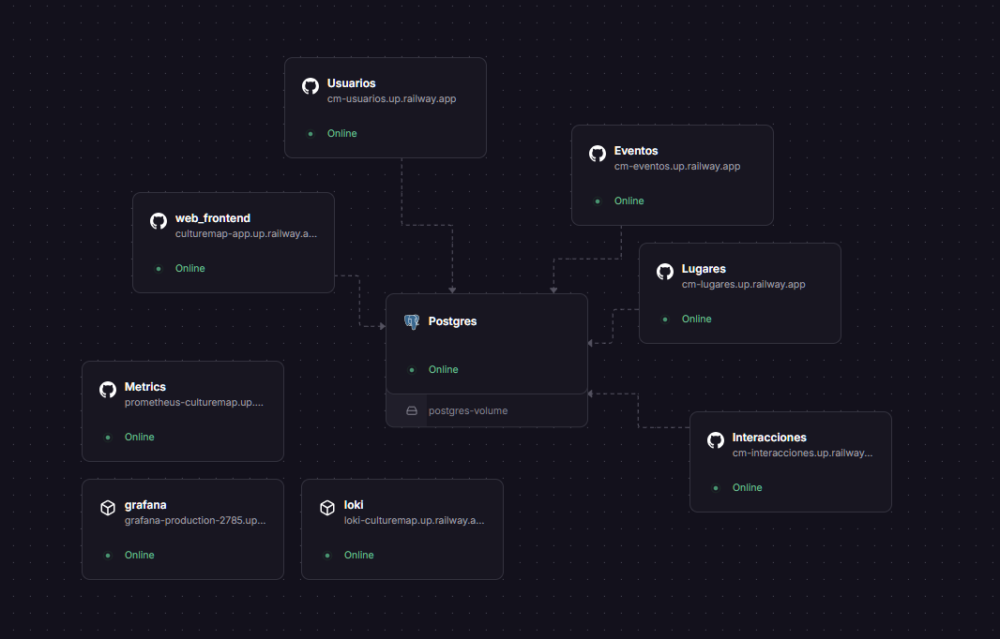
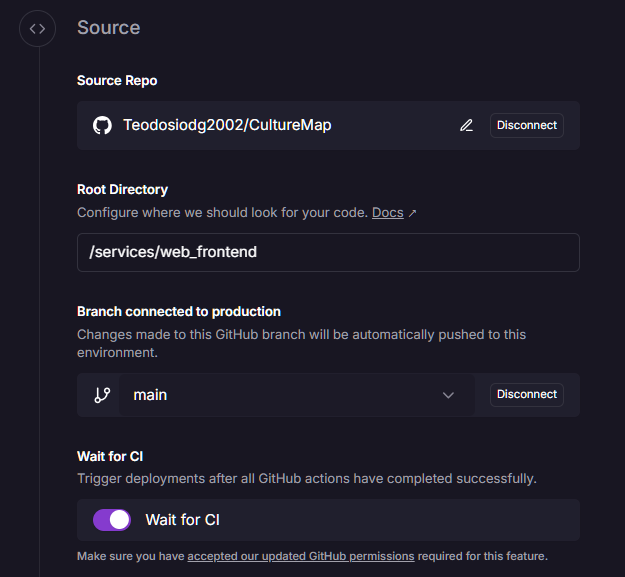
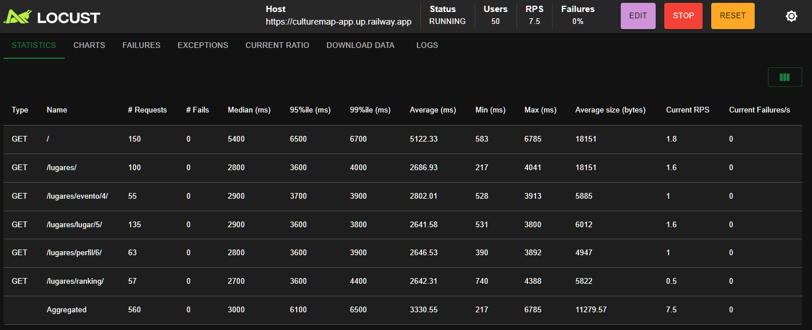
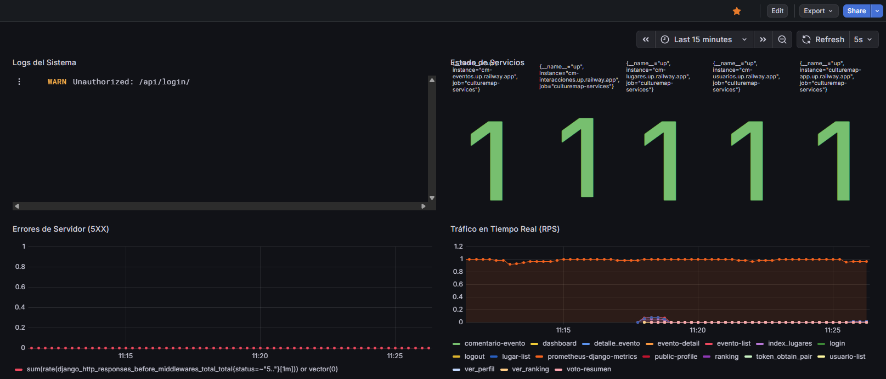
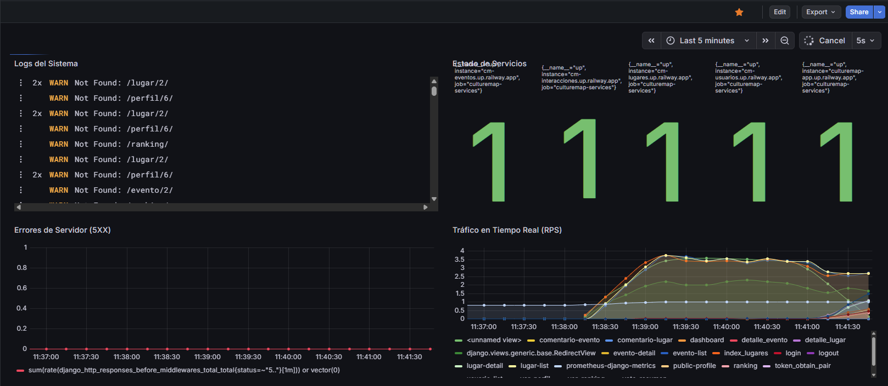

# ☁️ Hito 5: Despliegue en la Nube (IaaS/PaaS)

## 🎯 Objetivos del Hito

El objetivo principal de este hito ha sido migrar la arquitectura de microservicios, que anteriormente funcionaba en local con Docker Compose, a un entorno de producción real en la nube. Se ha realizado un despliegue utilizando una plataforma **PaaS (Platform as a Service)**, asegurando la escalabilidad, la seguridad y la persistencia de datos en un entorno público.

Al finalizar este hito, la aplicación **CultureMap** es accesible públicamente a través de internet, cuenta con bases de datos gestionadas en producción y ha sido sometida a pruebas de carga para validar su rendimiento.

---

## 1. Elección del Proveedor de Nube (PaaS)

Para el despliegue de la infraestructura se ha seleccionado **Railway**.

### 1.1. Justificación de la elección

Se han evaluado diferentes alternativas antes de tomar la decisión final:

- **AWS (EC2/ECS)**  
  Descartada por la alta complejidad de configuración inicial para una arquitectura de microservicios (VPC, Security Groups, Load Balancers) y el riesgo de costes ocultos fuera de la capa gratuita.

- **Heroku**  
  Históricamente el estándar, pero descartado debido a la eliminación de su capa gratuita y a las limitaciones en la gestión de múltiples microservicios sin costes elevados.

- **Railway (ELEGIDA)**  
  - **Microservicios Nativos**: Permite desplegar múltiples servicios interconectados dentro de un mismo proyecto, visualizándolos en un *Canvas* gráfico muy intuitivo.  
  - **Despliegue desde Monorepo**: Soporte nativo para repositorios con múltiples aplicaciones, permitiendo configurar *Watch Paths* para que solo se redespliegue el servicio afectado.  
  - **Base de Datos Gestionada**: Instancias de PostgreSQL listas para producción con copias de seguridad automáticas y gestión de conexiones.  
  - **Variables de Entorno Compartidas**: Inyección segura de secretos (`SECRET_KEY`, credenciales de base de datos, etc.).

---

## 2. Arquitectura del Despliegue en la Nube

A diferencia del entorno local (Docker Compose), en la nube cada microservicio funciona como una entidad independiente con su propio dominio y recursos asignados.

### 2.1. Componentes Desplegados

La infraestructura en Railway se compone de los siguientes nodos:

- **Web Frontend**: Servidor que se encarga de la visualización de la app. Y además, conecta a las APIs de backend mediante variables de entorno públicas.
- **Backends (x4)**: Servicios independientes para **Usuarios**, **Lugares**, **Eventos** e **Interacciones**, cada uno ejecutándose en contenedores aislados.
- **Bases de Datos (x4)**: Se ha mantenido el patrón *Database-per-Service*. Railway gestiona cuatro instancias lógicas de PostgreSQL, asegurando el aislamiento físico de los datos.

**Evidencia de la Arquitectura (Canvas)**  
En la siguiente imagen se aprecia la orquestación de los servicios en Railway y cómo se interconectan entre sí.



---

## 3. Herramientas y Configuración del Despliegue

Para adaptar la aplicación de desarrollo a producción, se han realizado configuraciones críticas tanto en el código como en la plataforma.

### 3.1. Servidor de Aplicaciones (Gunicorn)

En local se utilizaba el servidor de desarrollo de Django (`runserver`), que no es seguro para producción. Para el despliegue en la nube se ha configurado **Gunicorn** como servidor WSGI mediante comandos de arranque personalizados.

Ejemplo de comando de arranque para el servicio de **Lugares**:

```bash
gunicorn service_lugares.wsgi:application --bind 0.0.0.0:$PORT
```

### 3.2. Gestión de Seguridad (CSRF y Puertos)

Uno de los mayores retos del despliegue en la nube es la gestión de dominios y seguridad cruzada (CORS/CSRF).

- **Puertos Dinámicos**  
  La aplicación escucha en la variable de entorno `$PORT` inyectada por Railway, evitando el uso de puertos fijos.

- **Confianza en Dominios (CSRF)**  
  Se ha modificado el `settings.py` de todos los servicios para confiar en los orígenes seguros de la plataforma y evitar bloqueos en peticiones POST desde el frontend.

```bash
CSRF_TRUSTED_ORIGINS = [
"https://*.up.railway.app",
"https://culturemap-app.up.railway.app
"
]

SECURE_PROXY_SSL_HEADER = ('HTTP_X_FORWARDED_PROTO', 'https')
```

### 3.3. Variables de Entorno (Configuration as Code)

No existen credenciales en el código fuente. Toda la configuración sensible se inyecta mediante variables de entorno gestionadas por Railway:

- `DATABASE_URL`: Conexión automática a la base de datos gestionada.
- `SECRET_KEY`: Clave unificada para asegurar la validez de los tokens JWT entre microservicios.
- `DEBUG`: Establecido a `False` por seguridad.

---

## 4. Automatización del Despliegue (CI/CD)

El despliegue está completamente automatizado siguiendo la metodología **GitOps**.

- **Trigger**: `git push` a la rama `main` en GitHub.
- **Detección**: Railway identifica el cambio y, gracias a los *Watch Paths*, detecta qué servicio ha sido modificado.
- **Build & Deploy**:
  - Si solo se modifica el servicio de lugares, Railway reconstruye y despliega únicamente ese contenedor.
  - Esto optimiza los tiempos de despliegue y reduce el consumo de recursos.



---

## 5. Pruebas de Prestaciones (Stress Testing)

Para validar la robustez de la infraestructura desplegada en el IaaS (**Railway**), se ha realizado una prueba de carga utilizando **Locust**. El objetivo ha sido simular un tráfico concurrente realista para verificar que los microservicios escalan y responden adecuadamente sin que el servicio falle.

### Configuración de la Prueba

- **Herramienta**: Locust (framework de pruebas de carga en Python).
- **Objetivo**: Entorno de producción  
  https://culturemap-app.up.railway.app
- **Carga**: 50 usuarios concurrentes (simulados).
- **Tasa de aparición (Spawn Rate)**: 5 usuarios nuevos por segundo.

### Escenario Simulado (locustfile.py)

Cada usuario virtual ejecuta un ciclo de navegación que recorre los puntos críticos del sistema:

- Carga de la página de inicio (listado de lugares).
- Consulta del detalle de un lugar  
  (petición a `service-lugares` + `service-interacciones`).
- Consulta del detalle de un evento.
- Visualización del ranking de usuarios y perfil público  
  (petición a `service-usuarios`).

### Resultados Obtenidos

Como se observa en la captura de la interfaz de Locust, el sistema mantuvo una tasa de peticiones por segundo (**RPS**) estable con un tiempo de respuesta medio aceptable. No se registraron caídas del servidor ni errores críticos durante la prueba de estrés.



**Figura 5.1**: Panel de control de Locust durante la ejecución de la prueba de carga con 50 usuarios concurrentes.

---

## 6. Monitorización y Observabilidad

Para cumplir con los requisitos de observabilidad en la nube, se ha desplegado un stack completo de monitorización compuesto por **Prometheus**, **Loki** y **Grafana**, ejecutándose en contenedores independientes dentro de Railway.

### 6.1. Arquitectura de Monitorización

- **Recolección de Métricas (Prometheus)**
 Cada microservicio Django (backend y frontend) ha sido instrumentado mediante `django-prometheus`. Prometheus realiza *scraping* cada 15 segundos a los endpoints `/metrics` de los cinco servicios desplegados.

- **Ingesta de Logs (Loki)**  
  El sistema de logging de Django se ha configurado para enviar los registros en tiempo real a Loki mediante `python-logging-loki`, centralizando la salida de logs de todos los contenedores.

- **Visualización (Grafana)**  
  Se ha diseñado un dashboard unificado que conecta con Prometheus y Loki, permitiendo correlacionar métricas y logs en un único panel de control.

### 6.2. Dashboard de Operaciones

El panel de control diseñado permite una interpretación clara del estado del sistema en tiempo real. Se estructura en cuatro niveles de información:

- **Estado de Servicios (Semáforos)**  
  Indicadores visuales basados en la métrica `up`, que verifican que los cinco contenedores  
  (Frontend + 4 microservicios) están activos y respondiendo correctamente.

- **Tráfico en Tiempo Real (RPS)**  
  Gráfica de series temporales basada en `rate()`, que muestra la carga exacta que recibe cada vista de la aplicación.

- **Tasa de Errores (5XX)**  
  Monitorización de respuestas HTTP 500, permitiendo detectar fallos críticos en el código bajo condiciones de carga.

- **Logs en Vivo (Traza)**  
  Panel conectado a Loki que muestra las peticiones HTTP y mensajes del sistema en tiempo real, facilitando la depuración durante picos de tráfico.

### Evidencias



**Figura 6.1**: Dashboard de Grafana en estado de reposo. Los servicios están operativos (verde) con tráfico residual.



**Figura 6.2**: Dashboard durante la prueba de estrés. Se observa el aumento drástico del tráfico en tiempo real y la ingesta masiva de logs, correlacionándose con la ejecución de Locust.

---

## 7. Enlace al Despliegue

La aplicación se encuentra operativa y accesible públicamente en la siguiente URL:

🚀 **Acceder a CultureMap**

<https://culturemap-app.up.railway.app>
